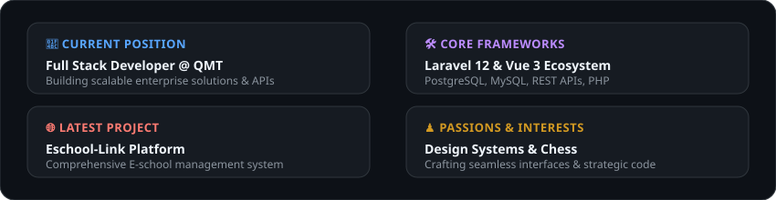
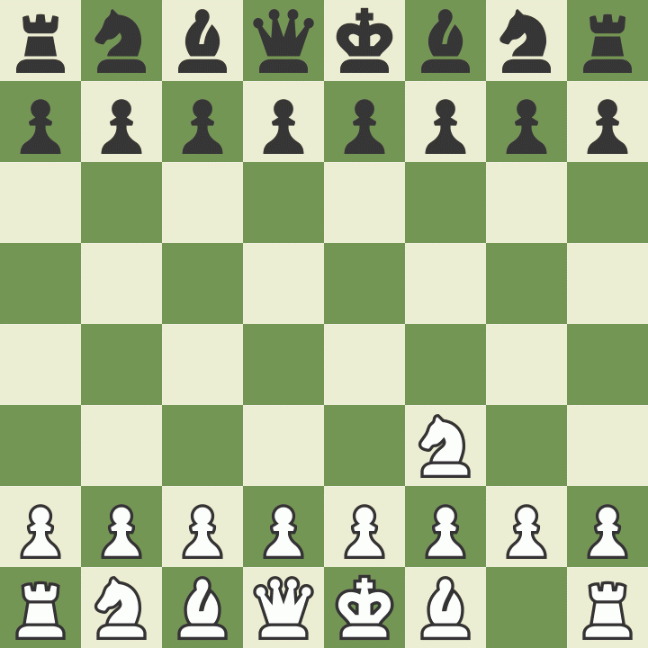

<div align="center">

  <!-- Welcome Header Banner -->
  

  <br/><br/>

  <!-- Glassmorphic Social Badges -->
  <a href="https://www.linkedin.com/in/natnael-tiku-3966a0381/">
    
  </a>
  <a href="http://natsfolio.vercel.app/">
    
  </a>
  <a href="https://x.com/Natnael163260">
    
  </a>
  <a href="https://instagram.com/nathaniel_abebe">
    
  </a>

</div>

<br/>


<br/>

## 🚀 About Me

<div align="center">
  
</div>

<br/>

```yaml
Name: Natnael Abebe
Role: Full Stack Developer @ QMT
Specialties: Laravel 12, Vue.js, REST APIs, UI/UX Design Systems
Current Focus: Scalable Web Apps & High Performance Backends
Passions: Clean Architecture, Modern Web Aesthetics, Chess Strategy ♟️
```

<br/>


<br/>

## 🛠️ Tech Stack & Ecosystem

<div align="center">
  <h3>⚡ Languages & Core</h3>
  <p>
    <a href="https://www.php.net"></a>
    <a href="https://developer.mozilla.org/en-US/docs/Web/JavaScript"></a>
    <a href="https://www.w3schools.com/cpp/"></a>
    <a href="https://www.java.com"></a>
    <a href="https://www.python.org"></a>
    <a href="https://www.w3.org/html/"></a>
    <a href="https://www.w3schools.com/css/"></a>
  </p>

  <h3>🎨 Frontend & Styling</h3>
  <p>
    <a href="https://vuejs.org/"></a>
    <a href="https://reactjs.org/"></a>
    <a href="https://tailwindcss.com/"></a>
    <a href="https://www.framer.com/"></a>
  </p>

  <h3>⚙️ Backend & Database</h3>
  <p>
    <a href="https://laravel.com/"></a>
    <a href="https://www.postgresql.org/"></a>
    <a href="https://www.mysql.com/"></a>
    <a href="https://firebase.google.com/"></a>
  </p>

  <h3>📐 Tools & Design</h3>
  <p>
    <a href="https://git-scm.com/"></a>
    <a href="https://www.figma.com/"></a>
    <a href="https://www.adobe.com/products/xd.html"></a>
  </p>
</div>

<br/>


<br/>

## 🌐 Featured Project

<table>
  <tr>
    <td width="100%" stroke="none">
      <h3 fill="#00f2fe">🏫 Eschool-Link</h3>
      <p>A comprehensive E-school management system designed to streamline school administration, academic tracking, student records, and interactive portal workflows.</p>
    </td>
  </tr>
</table>

<br/>


<br/>

## ☕ Beyond Code & Personal Corner

<div align="center">
  <table border="0">
    <tr>
      <td align="center" width="33%">
        
        <br/>
        <sub><b>Always Coding</b></sub>
      </td>
      <td align="center" width="33%">
        
        <br/>
        <sub><b>Tactical Mindset</b></sub>
      </td>
      <td align="center" width="33%">
        
        <br/>
        <sub><b>Good Vibes</b></sub>
      </td>
    </tr>
  </table>
</div>

<br/>

<div align="center">
  <sub>Designed  by <b>Natnaels </b> @2024</sub>
</div>
